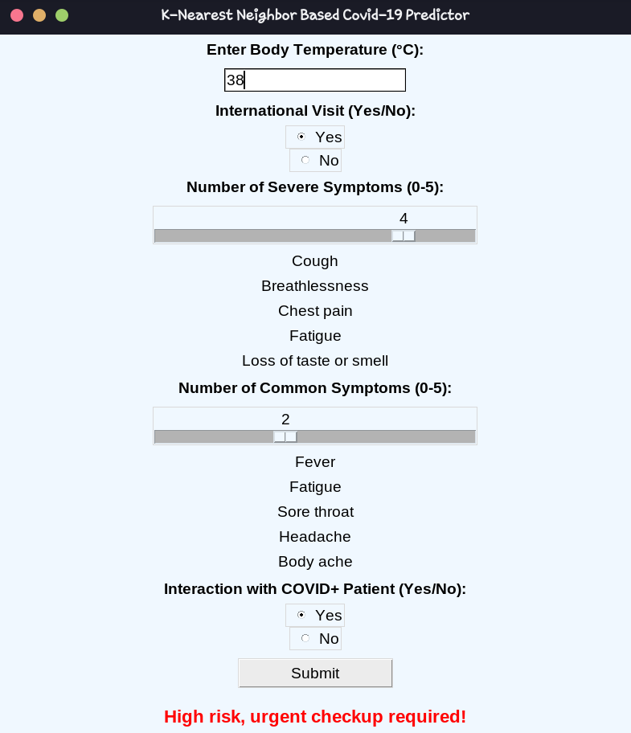

# COVID-19-Prediction-ML-KNN

This project implements a K-Nearest Neighbors (KNN) model to assess the risk of a user's health condition based on various input parameters like body temperature, symptoms, and recent interactions. The application provides a simple GUI built using Python's `tkinter` library.

## Features
- **User-Friendly Interface**: Simple GUI for data input and result display.
- **Risk Assessment**: Calculates the risk level (Low, Moderate, or High) based on the KNN algorithm.
- **Real-Time Feedback**: Provides a risk level and actionable advice based on user input.
- **Dataset Flexibility**: Predefined dataset for KNN model that can be easily extended.

## Dataset

The dataset used in this project is predefined and contains the following features:
- **Body Temperature** (°C)
- **International Visit** (Yes/No)
- **Number of Severe Symptoms** (0-5)
- **Number of Common Symptoms** (0-5)
- **Interaction with COVID-Positive Person** (Yes/No)
- **Risk Level** (Low, Moderate, High)

The dataset is used to calculate the Euclidean distance between user inputs and predefined data points to predict the risk level.

## Example Dataset

```python
dataset = [
    [37.0, 1, 4, 3, 0, 'highrisk'], [36.5, 0, 2, 2, 0, 'highrisk'],
    [36.5, 0, 0, 1, 1, 'lowrisk'], [37.2, 1, 2, 2, 0, 'moderate'],
    [36.8, 1, 5, 3, 1, 'highrisk'], [37.5, 0, 0, 0, 0, 'lowrisk'],
    [36.91, 1, 1, 0, 1, 'moderate'], [37.3, 0, 5, 3, 1, 'highrisk'],
    [36.3, 0, 2, 1, 1, 'lowrisk'], [37.1, 1, 4, 3, 1, 'highrisk'],
    # Additional dataset entries...
]
```
## How to Use

1. **Run the Application**:
   - Launch the Python script using a Python IDE or terminal.

2. **Input Data**:
   - Enter your **Body Temperature (°C)** in the text box.
   - Select **Yes** or **No** for **International Visit** and **Interaction with COVID+ Patient**.
   - Use the sliders to indicate:
     - Number of **Severe Symptoms** (0-5).
     - Number of **Common Symptoms** (0-5).

3. **View Risk Assessment**:
   - Click the **Submit** button.
   - The application will display your **Risk Level** along with advice.

4. **Understand the Output**:
   - **Low Risk**: Stay at home. 🏠
   - **Moderate Risk**: Visit a doctor for a checkup. 🏥
   - **High Risk**: Urgent medical attention required. 🚨

### Images

#### Use Case



